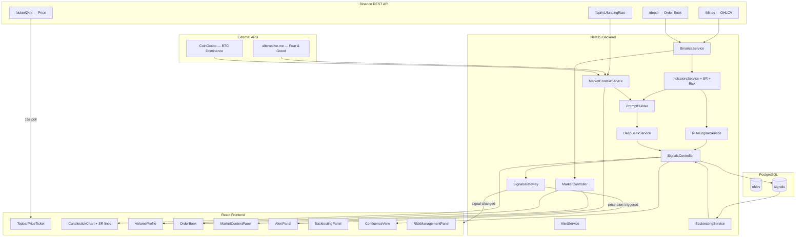
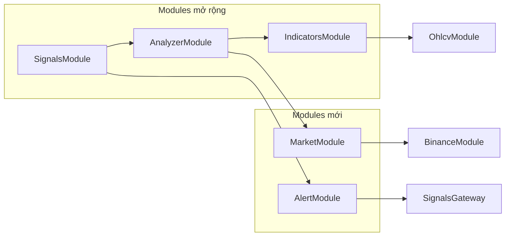
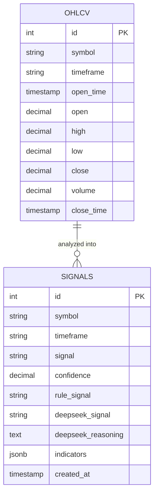

# Tài liệu Thiết kế — Crypto DSS Enhancements

> Tham chiếu yêu cầu: [requirements.md](./requirements.md)

## Tổng quan

Tài liệu này mô tả thiết kế kỹ thuật cho 10 cải tiến của hệ thống Crypto DSS. Các cải tiến được nhóm thành 4 nhóm chính:

- **Nhóm UI/UX**: Real-time price ticker (Req 1), CandlestickChart integration (Req 2), Confluence View (Req 9)
- **Nhóm Indicators & Engine**: Support/Resistance (Req 3), Rule Engine fix (Req 7), Risk Management hints (Req 10)
- **Nhóm Market Data**: Volume Profile/Order Book (Req 4), Market Context (Req 6)
- **Nhóm Analytics**: Price Alert (Req 5), Backtesting (Req 8)

Tất cả thay đổi được xây dựng trên nền tảng hiện có: Nx monorepo, NestJS backend, React/Vite frontend, PostgreSQL + TypeORM, Socket.io WebSocket.

## Kiến trúc

### Sơ đồ luồng dữ liệu tổng thể (sau enhancements)



### Kiến trúc Module Backend (sau enhancements)



## Thành phần và Giao diện

### Backend — Modules mới

#### MarketModule (`apps/backend/backend/src/modules/market/`)

**MarketContextService**

- Cache in-memory với TTL riêng cho từng nguồn dữ liệu
- `getFearGreedIndex(): Promise<FearGreedData | null>` — fetch mỗi 1h, cache 1h
- `getBtcDominance(): Promise<number | null>` — fetch mỗi 5 phút, cache 5 phút
- `getFundingRate(): Promise<number | null>` — fetch mỗi 1h, cache 1h
- `getContext(): Promise<MarketContext>` — aggregate 3 nguồn, null-safe

**MarketController**

- `GET /market/context` → `MarketContext`
- `GET /market/orderbook?symbol=ETHUSDT` → `OrderBookData`
- `GET /market/volume-profile?symbol=ETHUSDT&timeframe={tf}` → `VolumeProfileBucket[]`

**VolumeProfileService**

- `calculate(candles: OhlcvEntity[]): VolumeProfileBucket[]` — chia 20 bucket theo price range, tổng hợp volume

#### AlertModule (`apps/backend/backend/src/modules/alert/`)

**AlertService**

- In-memory store: `Map<string, PriceAlert>`
- `createAlert(dto: CreateAlertDto): PriceAlert` — throw nếu đã có 10 alerts
- `deleteAlert(id: string): void`
- `getAlerts(): PriceAlert[]`
- `checkAlerts(currentPrice: number): void` — gọi mỗi lần TopbarPriceTicker fetch giá mới; emit `price-alert-triggered` qua SignalsGateway nếu triggered
- Alert bị xóa khỏi store sau khi triggered (one-shot)

### Backend — Modules mở rộng

#### IndicatorsModule — thay đổi

**indicators.service.ts** — bổ sung vào `calculate()`:

```typescript
const lastCandle = candles[candles.length - 1];
const closePrice = parseFloat(lastCandle.close as unknown as string);
const srLevels = calcSupportResistance(candles);
const riskHints = calcRiskHints(closePrice, volatility.atr);
return {
  trend,
  momentum,
  volatility,
  volume,
  patterns,
  closePrice,
  supportLevels: srLevels.support,
  resistanceLevels: srLevels.resistance,
  riskHints,
};
```

**sr.indicators.ts** (file mới):

- `calcSupportResistance(candles: OhlcvEntity[]): { support: number[], resistance: number[] }`
- Thuật toán: sliding window 20 nến, tìm local pivot high (high > max của 10 nến trước và sau) và local pivot low
- Trả về top 3 support (gần giá nhất từ dưới) và top 3 resistance (gần giá nhất từ trên)
- Trả về `{ support: [], resistance: [] }` nếu ít hơn 50 nến

**risk.indicators.ts** (file mới):

- `calcRiskHints(closePrice: number, atr: number | null): RiskHints | null`
- Công thức: `stopLoss = closePrice - (atr * 1.5)`, `takeProfit = closePrice + (atr * 3.0)`, `riskRewardRatio = (takeProfit - closePrice) / (closePrice - stopLoss)`
- Trả về `null` nếu `atr` là null

#### AnalyzerModule — thay đổi

**rule-engine.service.ts** — thay đổi:

- Thay `trend.ema9` bằng `indicators.closePrice` trong phép so sánh Bollinger Bands
- Thêm scoring cho SR levels: `+1` nếu `closePrice` trong phạm vi `0.5 * atr` của support, `-1` nếu trong phạm vi của resistance
- Bỏ qua nếu `closePrice` là null/undefined

**prompt-builder.ts** — thay đổi:

- Bổ sung section Market Context: fearGreedIndex, btcDominance, fundingRate
- Bổ sung section Risk Management: ATR, stopLoss gợi ý, takeProfit gợi ý
- Signature: `buildPrompt(data: Map<string, AllIndicators>, marketContext?: MarketContext): string`

#### SignalsModule — thay đổi

**signals.controller.ts** — endpoint mới:

- `GET /signals/candles?symbol=ETHUSDT&timeframe={tf}&limit=200` → `OhlcvCandle[]`
- `GET /signals/backtest?symbol=ETHUSDT&timeframe={tf}` → `BacktestResult`
- `GET /signals/confluence?symbol=ETHUSDT` → `SignalResult[]` (6 timeframes)

**BacktestingService** (thêm vào SignalsModule):

- `backtest(symbol: string, timeframe: string): Promise<BacktestResult>`
- Query signals từ DB, join với OHLCV để lấy giá nến tiếp theo
- Tính win/loss cho ruleSignal và deepseekSignal riêng biệt
- Trả về `{ ruleWinRate: null, ... }` nếu tổng BUY+SELL < 10

### Frontend — Components mới

#### TopbarPriceTicker (thay thế PriceTicker hiện tại)

- Fetch `GET /api/v3/ticker/24hr?symbol=ETHUSDT` trực tiếp từ Binance mỗi 15s
- `useEffect` với `setInterval(fetch, 15000)` + fetch ngay khi mount
- Giữ state `lastKnownData` để hiển thị khi API lỗi
- Hiển thị: lastPrice (2 decimal, JetBrains Mono), priceChangePercent (màu buy/sell), priceChange (dấu +/-)

#### AlertPanel

- Form: input số (target price) + select (ABOVE/BELOW) + button "Set Alert"
- List: hiển thị alerts active, nút xóa từng alert
- Validation: disable form khi đã có 10 alerts, hiển thị error message
- Lắng nghe WebSocket event `price-alert-triggered` → hiển thị toast

#### MarketContextPanel

- Hiển thị 3 card: Fear & Greed (số + label), BTC Dominance (%), Funding Rate (màu buy/sell)
- Fetch `GET /market/context` mỗi 5 phút
- Hiển thị "—" khi giá trị null

#### BacktestingPanel

- Fetch `GET /signals/backtest?symbol=ETHUSDT&timeframe={tf}` khi timeframe thay đổi
- Hiển thị: Rule Win Rate (%), AI Win Rate (%), số mẫu
- Hiển thị "Chưa đủ dữ liệu" khi winRate null

#### ConfluenceView

- Bảng 6 hàng × 6 cột: Timeframe, Signal badge, Confidence %, Rule Signal, AI Signal, Updated
- Confluence Score: đếm signal type phổ biến nhất / 6, hiển thị %
- Border glow khi tất cả 6 timeframe đồng thuận
- Auto-refresh mỗi 30s + lắng nghe `signal-changed`
- Skeleton loading cho từng hàng

#### RiskManagementPanel

- Hiển thị trong SignalCard khi signal != HOLD
- Stop Loss (màu đỏ), Take Profit (màu xanh), R/R Ratio (ví dụ: 1:2.0)
- Ẩn hoàn toàn khi signal = HOLD
- Hiển thị "—" khi riskHints null

### Frontend — Components mở rộng

**CandlestickChart** — thêm SR lines:

- Nhận thêm prop `srLevels?: { support: number[], resistance: number[] }`
- Vẽ `PriceLine` cho mỗi support (màu xanh, dashed) và resistance (màu đỏ, dashed) bằng `series.createPriceLine()`

**Dashboard** — layout mới:

- Thêm `TopbarPriceTicker` vào Topbar (thay PriceTicker cũ)
- Thêm `CandlestickChart` với SR lines
- Thêm `MarketContextPanel`, `AlertPanel`, `BacktestingPanel`, `ConfluenceView`, `RiskManagementPanel`
- Fetch `/signals/candles` khi timeframe thay đổi

## Mô hình Dữ liệu

### Shared Types — thay đổi và bổ sung

```typescript
// indicator.types.ts — bổ sung vào AllIndicators
export interface SRLevels {
  supportLevels: number[]; // tối đa 3, sắp xếp gần giá nhất trước
  resistanceLevels: number[]; // tối đa 3, sắp xếp gần giá nhất trước
}

export interface RiskHints {
  stopLoss: number;
  takeProfit: number;
  riskRewardRatio: number;
}

export interface AllIndicators {
  trend: TrendIndicators;
  momentum: MomentumIndicators;
  volatility: VolatilityIndicators;
  volume: VolumeIndicators;
  patterns: CandlestickPatterns;
  // --- Enhancements ---
  closePrice: number | null;
  supportLevels: number[];
  resistanceLevels: number[];
  riskHints: RiskHints | null;
}
```

### New Types (market.types.ts)

```typescript
export interface FearGreedData {
  value: number; // 0-100
  label: string; // "Extreme Fear" | "Fear" | "Neutral" | "Greed" | "Extreme Greed"
}

export interface MarketContext {
  fearGreedIndex: FearGreedData | null;
  btcDominance: number | null; // phần trăm, ví dụ 52.3
  fundingRate: number | null; // ví dụ 0.0001
}

export interface OrderBookEntry {
  price: number;
  quantity: number;
}

export interface OrderBookData {
  bids: OrderBookEntry[]; // 20 mức tốt nhất
  asks: OrderBookEntry[]; // 20 mức tốt nhất
  spread: number; // ask[0].price - bid[0].price
  spreadPercent: number; // spread / bid[0].price * 100
}

export interface VolumeProfileBucket {
  priceLevel: number; // giá trung tâm của bucket
  volume: number; // tổng volume trong bucket
}
```

### New Types (alert.types.ts)

```typescript
export type AlertCondition = 'ABOVE' | 'BELOW';

export interface PriceAlert {
  id: string; // UUID
  symbol: string;
  targetPrice: number;
  condition: AlertCondition;
  createdAt: Date;
  triggered: boolean;
}

export interface CreateAlertDto {
  symbol: string;
  targetPrice: number;
  condition: AlertCondition;
}
```

### New Types (backtest.types.ts)

```typescript
export interface BacktestResult {
  symbol: string;
  timeframe: string;
  totalSignals: number;
  winCount: number;
  lossCount: number;
  ruleWinRate: number | null; // null nếu < 10 tín hiệu
  deepseekWinRate: number | null;
  insufficientData: boolean;
}
```

### Entity Relationship (sau enhancements)



> Không có bảng mới. AlertService dùng in-memory store. MarketContext và OrderBook là transient data không cần persist.

## Correctness Properties

_A property là một đặc tính hoặc hành vi phải luôn đúng trong mọi lần thực thi hợp lệ của hệ thống — về bản chất, đó là một phát biểu hình thức về những gì hệ thống phải làm. Properties đóng vai trò cầu nối giữa đặc tả dễ đọc cho con người và đảm bảo tính đúng đắn có thể kiểm chứng bằng máy._

### Property 1: Price display formatting

_For any_ ticker data từ Binance API với lastPrice, priceChange, và priceChangePercent, giá trị hiển thị phải có đúng 2 chữ số thập phân, priceChange phải có dấu "+" khi dương và "-" khi âm, và màu hiển thị phải là `var(--buy)` khi priceChangePercent >= 0 và `var(--sell)` khi < 0.

**Validates: Requirements 1.2, 1.3, 1.4**

### Property 2: Price fetch error resilience

_For any_ sequence của N lần fetch thành công tiếp theo bởi M lần fetch thất bại, giá trị hiển thị sau M lần thất bại phải bằng giá trị từ lần fetch thành công cuối cùng — không bao giờ là undefined hoặc null.

**Validates: Requirements 1.5**

### Property 3: Candles endpoint contract

_For any_ request tới `GET /signals/candles?symbol=X&timeframe=Y&limit=N`, response phải là mảng OhlcvCandle với length <= N, mỗi phần tử có đầy đủ các trường: symbol, timeframe, openTime, open, high, low, close, volume, closeTime, và được sắp xếp theo openTime tăng dần.

**Validates: Requirements 2.3, 2.5**

### Property 4: Timeframe change triggers data refresh

_For any_ timeframe T1 đang được chọn, khi người dùng chọn timeframe T2 (T2 ≠ T1), Dashboard phải fetch dữ liệu nến mới với timeframe=T2 và truyền dữ liệu đó vào CandlestickChart.

**Validates: Requirements 2.4**

### Property 5: SR levels computation correctness

_For any_ mảng OhlcvEntity có ít nhất 50 nến, `calcSupportResistance()` phải trả về: (a) tất cả support levels nhỏ hơn giá close của nến cuối cùng, (b) tất cả resistance levels lớn hơn giá close của nến cuối cùng, (c) mỗi mảng có tối đa 3 phần tử, (d) sắp xếp theo khoảng cách tăng dần từ giá hiện tại.

**Validates: Requirements 3.1, 3.2**

### Property 6: SR levels scoring in Rule Engine

_For any_ AllIndicators với closePrice gần một support level (trong phạm vi 0.5 × ATR), score của Rule Engine phải cao hơn so với cùng indicators nhưng closePrice ở vị trí trung tính; tương tự, closePrice gần resistance phải cho score thấp hơn.

**Validates: Requirements 3.3**

### Property 7: Volume Profile bucket coverage

_For any_ mảng OhlcvEntity hợp lệ, `VolumeProfileService.calculate()` phải trả về đúng 20 bucket, tổng volume của tất cả bucket phải bằng tổng volume của tất cả nến đầu vào, và mỗi bucket phải có priceLevel nằm trong khoảng [min_low, max_high] của dữ liệu.

**Validates: Requirements 4.4**

### Property 8: Order Book endpoint contract

_For any_ request tới `GET /market/orderbook?symbol=X`, response phải có bids và asks mỗi mảng có đúng 20 phần tử, spread = asks[0].price - bids[0].price, và spreadPercent = spread / bids[0].price × 100.

**Validates: Requirements 4.2**

### Property 9: Alert trigger correctness

_For any_ PriceAlert với condition=ABOVE và targetPrice=T, khi `checkAlerts(price)` được gọi với price > T thì alert phải được đánh dấu triggered; với condition=BELOW và price < T thì alert phải triggered; trong mọi trường hợp khác alert không được triggered.

**Validates: Requirements 5.3, 5.6**

### Property 10: Alert capacity limit

_For any_ AlertService đang có đúng 10 alerts, gọi `createAlert()` phải throw error; với ít hơn 10 alerts, `createAlert()` phải thành công và tổng số alerts tăng lên 1.

**Validates: Requirements 5.7**

### Property 11: MarketContext cache behavior

_For any_ MarketContextService, nếu `getContext()` được gọi hai lần trong khoảng thời gian nhỏ hơn TTL của từng nguồn, số lần gọi HTTP tới external API phải bằng 1 (không phải 2) — tức cache được sử dụng.

**Validates: Requirements 6.1, 6.2, 6.3**

### Property 12: MarketContext null isolation

_For any_ MarketContextService khi một trong ba external API trả về lỗi, `getContext()` phải trả về object với đúng một trường là null (trường tương ứng API lỗi) và hai trường còn lại có giá trị hợp lệ.

**Validates: Requirements 6.7**

### Property 13: Prompt contains market context

_For any_ MarketContext với fearGreedIndex, btcDominance, fundingRate không null, chuỗi prompt được tạo bởi `buildPrompt()` phải chứa cả ba giá trị này dưới dạng text.

**Validates: Requirements 6.6**

### Property 14: closePrice assignment correctness

_For any_ mảng OhlcvEntity có ít nhất 1 nến, `IndicatorsService.calculate()` phải trả về `closePrice` bằng đúng giá trị `close` của nến cuối cùng trong mảng (sau khi parse float).

**Validates: Requirements 7.2**

### Property 15: Rule Engine uses closePrice for BB comparison

_For any_ AllIndicators với closePrice=C và ema9=E (C ≠ E), kết quả scoring của Bollinger Bands phải phản ánh vị trí của C (không phải E) so với bbLower và bbUpper.

**Validates: Requirements 7.3, 7.4**

### Property 16: Rule Engine null closePrice safety

_For any_ AllIndicators với closePrice=null, `RuleEngineService.analyze()` phải hoàn thành mà không throw error, và score từ các indicators khác (RSI, MACD, v.v.) phải không bị ảnh hưởng.

**Validates: Requirements 7.5**

### Property 17: Backtesting win rate formula

_For any_ tập hợp signals lịch sử với W tín hiệu thắng và L tín hiệu thua (W + L >= 10), `BacktestingService.backtest()` phải trả về `winRate = W / (W + L)` với sai số không quá 0.001, và `winCount = W`, `lossCount = L`, `totalSignals = W + L`.

**Validates: Requirements 8.2, 8.3, 8.4**

### Property 18: Confluence endpoint returns all timeframes

_For any_ request tới `GET /signals/confluence?symbol=X`, response phải là mảng có đúng 6 phần tử, mỗi phần tử có timeframe thuộc {1m, 5m, 15m, 1h, 4h, 1d}, và không có timeframe nào bị lặp lại.

**Validates: Requirements 9.2**

### Property 19: Confluence score calculation

_For any_ mảng 6 SignalResult, ConfluenceView phải tính Confluence Score = (số timeframe có SignalType phổ biến nhất) / 6, và khi tất cả 6 timeframe có cùng SignalType thì score = 1.0 (100%).

**Validates: Requirements 9.3**

### Property 20: Risk hints formula correctness

_For any_ closePrice=C và atr=A (A > 0), `calcRiskHints(C, A)` phải trả về: `stopLoss = C - (A × 1.5)`, `takeProfit = C + (A × 3.0)`, `riskRewardRatio = (takeProfit - C) / (C - stopLoss) = 2.0` (hằng số do công thức cố định).

**Validates: Requirements 10.1**

### Property 21: Prompt contains risk hints

_For any_ AllIndicators với riskHints không null, chuỗi prompt được tạo bởi `buildPrompt()` phải chứa giá trị stopLoss và takeProfit.

**Validates: Requirements 10.3**

## Xử lý Lỗi

### Backend

| Thành phần           | Loại lỗi                                                    | Xử lý                                                                         |
| -------------------- | ----------------------------------------------------------- | ----------------------------------------------------------------------------- |
| MarketContextService | External API lỗi (Fear & Greed, CoinGecko, Binance Futures) | Log error, trả về null cho trường đó, không ảnh hưởng trường khác             |
| MarketController     | Binance /depth API lỗi                                      | Trả về HTTP 503 với message mô tả                                             |
| AlertService         | Tạo alert thứ 11                                            | Throw `BadRequestException('Đã đạt giới hạn 10 alerts')`                      |
| BacktestingService   | Ít hơn 10 tín hiệu BUY+SELL                                 | Trả về `{ ruleWinRate: null, deepseekWinRate: null, insufficientData: true }` |
| IndicatorsService    | Ít hơn 50 nến cho SR                                        | Trả về `{ supportLevels: [], resistanceLevels: [] }`                          |
| IndicatorsService    | ATR null khi tính riskHints                                 | Trả về `riskHints: null`                                                      |
| RuleEngineService    | closePrice null                                             | Bỏ qua BB và SR scoring, tiếp tục các phần khác                               |

### Frontend

| Thành phần          | Loại lỗi                | Xử lý                                                  |
| ------------------- | ----------------------- | ------------------------------------------------------ |
| TopbarPriceTicker   | Binance API lỗi         | Giữ nguyên `lastKnownData`, không crash                |
| AlertPanel          | Tạo alert thứ 11        | Hiển thị error message "Đã đạt giới hạn 10 alerts"     |
| MarketContextPanel  | Giá trị null từ API     | Hiển thị "—" cho trường đó                             |
| RiskManagementPanel | riskHints null          | Hiển thị "—" cho tất cả trường                         |
| RiskManagementPanel | signal = HOLD           | Ẩn panel hoàn toàn                                     |
| BacktestingPanel    | insufficientData = true | Hiển thị "Chưa đủ dữ liệu (cần tối thiểu 10 tín hiệu)" |

## Testing Strategy

### Dual Testing Approach

**Unit Tests** — ví dụ cụ thể và edge cases:

- `calcSupportResistance`: test với mảng < 50 nến → empty arrays
- `BacktestingService`: test với < 10 signals → null winRate
- `AlertService.createAlert`: test tạo alert thứ 11 → throw error
- `MarketController`: mock Binance API lỗi → HTTP 503
- `RiskManagementPanel`: render với signal=HOLD → panel ẩn

**Property-Based Tests** — universal properties:

- Thư viện: `fast-check` (TypeScript)
- Mỗi property test chạy tối thiểu 100 iterations
- Tag format: `Feature: crypto-dss-enhancements, Property {N}: {property_text}`
- Mỗi correctness property ở trên tương ứng với MỘT property-based test

### Property Test Mapping

| Property | Test description       | fast-check arbitraries                                                           |
| -------- | ---------------------- | -------------------------------------------------------------------------------- |
| P1       | Price formatting       | `fc.float()`, `fc.boolean()`                                                     |
| P2       | Error resilience       | `fc.array(fc.oneof(fc.record(...), fc.constant(null)))`                          |
| P3       | Candles endpoint       | `fc.record({ symbol, timeframe, limit })`                                        |
| P5       | SR levels              | `fc.array(ohlcvArb, { minLength: 50 })`                                          |
| P7       | Volume profile buckets | `fc.array(ohlcvArb, { minLength: 1 })`                                           |
| P9       | Alert trigger          | `fc.record({ condition, targetPrice, currentPrice })`                            |
| P10      | Alert capacity         | `fc.array(alertArb, { minLength: 0, maxLength: 11 })`                            |
| P11      | Cache behavior         | `fc.integer({ min: 1, max: 3600 })` (time elapsed)                               |
| P14      | closePrice assignment  | `fc.array(ohlcvArb, { minLength: 1 })`                                           |
| P17      | Win rate formula       | `fc.array(signalArb, { minLength: 10 })`                                         |
| P19      | Confluence score       | `fc.array(fc.constantFrom('BUY','SELL','HOLD'), { minLength: 6, maxLength: 6 })` |
| P20      | Risk hints formula     | `fc.float({ min: 0.01 })` (closePrice), `fc.float({ min: 0.001 })` (atr)         |

### Test Coverage Priority

1. **Cao**: SR levels (P5, P6), Alert trigger (P9, P10), Risk hints formula (P20), closePrice fix (P14, P15, P16)
2. **Trung bình**: Backtesting win rate (P17), Confluence score (P19), Volume profile (P7)
3. **Thấp**: UI rendering properties (P1, P2, P4), API contracts (P3, P8, P18)
