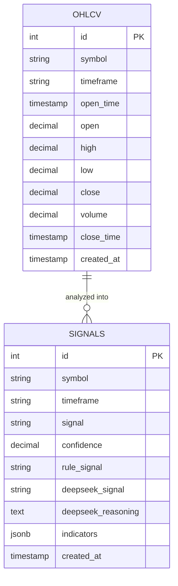

# Tài liệu Thiết kế — Crypto DSS (Decision Support System)

> Tham chiếu yêu cầu: [requirements.md](./requirements.md)

## Tổng quan

Crypto DSS là hệ thống hỗ trợ quyết định giao dịch ETH/USDT trên Binance, được xây dựng trên kiến trúc Nx monorepo với NestJS backend và React/Vite frontend. Hệ thống thu thập dữ liệu OHLCV real-time, tính toán 25+ chỉ số kỹ thuật, phân tích kết hợp Rule Engine (40%) + DeepSeek LLM (60%), và hiển thị tín hiệu BUY/SELL/HOLD trên dashboard phong cách "Quantex Terminal".

Đây là hệ thống hỗ trợ quyết định, không phải bot giao dịch tự động.

## Kiến trúc

### Sơ đồ luồng dữ liệu

```mermaid
flowchart TD
    A[Binance REST API] -->|GET /api/v3/klines| B[BinanceService]
    B -->|OhlcvCandle[]| C[OhlcvService]
    C -->|Upsert| D[(PostgreSQL - bảng ohlcv)]

    E[OhlcvScheduler] -->|30s cron| B
    E -->|Startup: 500 nến| B
    E -->|Weekly cleanup| C

    D -->|Query nến| F[IndicatorsService]
    F -->|AllIndicators| G[AnalyzerService]

    G -->|Song song| H[RuleEngineService]
    G -->|Song song| I[DeepSeekService]

    H -->|SignalType + Confidence 40%| G
    I -->|SignalType + Confidence 60%| G

    G -->|SignalResult| J[SignalsService]
    J -->|Change Detection| K[(PostgreSQL - bảng signals)]
    J -->|Nếu thay đổi| L[SignalsGateway - WebSocket]

    M[SignalsScheduler] -->|30s cron| G

    N[SignalsController - REST] -->|GET/POST| O[React Frontend]
    L -->|signal-changed event| O

    O --> P[Dashboard]
    P --> Q[SignalCard + ConfidenceGauge]
    P --> R[IndicatorPanel - 5 tabs]
    P --> S[SignalHistory]
    P --> T[SignalToast]
```

### Kiến trúc Module Backend

```mermaid
graph LR
    subgraph AppModule
        CM[ConfigModule]
        TOM[TypeOrmModule]
        SM[ScheduleModule]
    end

    subgraph BinanceModule
        BS[BinanceService]
    end

    subgraph OhlcvModule
        OE[OhlcvEntity]
        OS[OhlcvService]
        OSch[OhlcvScheduler]
    end

    subgraph IndicatorsModule
        IS[IndicatorsService]
        TI[trend.indicators]
        MI[momentum.indicators]
        VI[volatility.indicators]
        VoI[volume.indicators]
        PI[patterns.indicators]
    end

    subgraph AnalyzerModule
        AS[AnalyzerService]
        RE[RuleEngineService]
        DS[DeepSeekService]
        PB[PromptBuilder]
    end

    subgraph SignalsModule
        SE[SignalEntity]
        SS[SignalsService]
        SC[SignalsController]
        SG[SignalsGateway]
        SSch[SignalsScheduler]
    end

    OhlcvModule --> BinanceModule
    IndicatorsModule --> OhlcvModule
    AnalyzerModule --> IndicatorsModule
    SignalsModule --> AnalyzerModule
```



### Quyết định thiết kế chính

| Quyết định                  | Lý do                                                                   |
| --------------------------- | ----------------------------------------------------------------------- |
| Nx monorepo                 | Chia sẻ types giữa backend/frontend, quản lý dependency tập trung       |
| TypeORM 0.3 + PostgreSQL 16 | ORM mature cho NestJS, PostgreSQL hỗ trợ JSON column cho indicators     |
| `technicalindicators` npm   | Thư viện TA phổ biến nhất cho Node.js, hỗ trợ 100+ indicators           |
| `openai` npm cho DeepSeek   | DeepSeek API tương thích OpenAI, tận dụng SDK có sẵn                    |
| Socket.io cho WebSocket     | Tích hợp tốt với NestJS (@nestjs/websockets), auto-reconnect            |
| Rule 40% + DeepSeek 60%     | Rule Engine cho tính nhất quán, DeepSeek cho phân tích ngữ cảnh sâu hơn |
| Signal Change Detection     | Chỉ lưu khi tín hiệu thay đổi, giảm noise và tiết kiệm storage          |
| Upsert (orIgnore) cho OHLCV | Tránh duplicate khi fetch overlap, đảm bảo idempotent                   |

## Thành phần và Giao diện

### Backend Modules

#### 1. BinanceModule

- **BinanceService**: Client gọi Binance REST API
  - `fetchKlines(symbol: string, interval: string, limit?: number, startTime?: number, endTime?: number): Promise<OhlcvCandle[]>`
  - Chuyển đổi raw kline array `[openTime, open, high, low, close, volume, closeTime, ...]` thành `OhlcvCandle`
  - Xử lý lỗi: log và throw, để caller quyết định retry

#### 2. OhlcvModule

- **OhlcvEntity**: TypeORM entity bảng `ohlcv`
  - Unique constraint: `(symbol, timeframe, openTime)`
  - Columns: id, symbol, timeframe, openTime, open, high, low, close, volume, closeTime, createdAt
  - Kiểu decimal `precision: 18, scale: 8` cho giá và volume
- **OhlcvService**: CRUD operations
  - `upsertCandles(candles: OhlcvCandle[]): Promise<void>` — bulk insert với `orIgnore`
  - `getCandles(symbol, timeframe, limit): Promise<OhlcvEntity[]>` — sắp xếp DESC theo openTime
  - `getLatestCandle(symbol, timeframe): Promise<OhlcvEntity | null>`
  - `deleteOlderThan(date: Date): Promise<number>`
- **OhlcvScheduler**: Cron jobs
  - `onModuleInit()`: Fetch 500 nến lịch sử cho 6 timeframe
  - `@Cron('*/30 * * * * *')`: Fetch 3 nến mới nhất mỗi 30s
  - `@Cron('0 2 * * 0')`: Xóa dữ liệu > 2 năm (Chủ nhật 2:00 AM)

#### 3. IndicatorsModule

- **IndicatorsService**: Orchestrator tính toán tất cả indicators
  - `calculate(candles: OhlcvEntity[]): AllIndicators`
  - Gọi 5 hàm helper: `calcTrend`, `calcMomentum`, `calcVolatility`, `calcVolume`, `calcPatterns`
- **Hàm helper** (pure functions):
  - `calcTrend(candles)`: EMA(9,21,50,200), DEMA 9, TEMA 9, MACD(12/26/9), ADX(14), PSAR, Ichimoku(9/26/52/26)
  - `calcMomentum(candles)`: RSI(14), StochRSI(14/14/3/3), Stochastic(14/3), Williams %R(14), CCI(20), ROC(12)
  - `calcVolatility(candles)`: Bollinger Bands(20/2), ATR(14)
  - `calcVolume(candles)`: OBV, VWAP, MFI(14), CMF(20)
  - `calcPatterns(candles)`: Doji, Hammer, Bullish/Bearish Engulfing, Morning/Evening Star
  - Trả về `null` khi không đủ dữ liệu cho indicator cụ thể

#### 4. AnalyzerModule

- **RuleEngineService**: Phân tích dựa trên luật
  - `analyze(indicators: AllIndicators): { signal: SignalType, confidence: number }`
  - Weighted scoring: mỗi indicator đóng góp điểm bullish (+) hoặc bearish (-)
  - Ngưỡng: BUY khi score > +threshold, SELL khi < -threshold, HOLD trong vùng trung tính
  - Bỏ qua indicators có giá trị null
- **DeepSeekService**: Phân tích bằng AI
  - `analyze(multiTimeframeData: Map<string, AllIndicators>): Promise<{ signal: SignalType, confidence: number, reasoning: string }>`
  - Sử dụng `openai` npm với `baseURL: 'https://api.deepseek.com'`
  - Fallback: trả về `{ signal: HOLD, confidence: 0, reasoning: 'API error' }` khi lỗi
- **PromptBuilder**: Tạo prompt cho DeepSeek
  - `buildPrompt(data: Map<string, AllIndicators>): string`
  - Tóm tắt indicators chính cho mỗi timeframe, yêu cầu trả về JSON `{ signal, confidence, reasoning }`
- **AnalyzerService**: Orchestrator
  - `analyzeTimeframe(symbol, timeframe): Promise<SignalResult>`
  - Flow: getCandles → calculate indicators → Promise.all([ruleEngine, deepseek]) → weighted combine
  - Trọng số: rule × 0.4 + deepseek × 0.6

#### 5. SignalsModule

- **SignalEntity**: TypeORM entity bảng `signals`
  - Columns: id, symbol, timeframe, signal, confidence, ruleSignal, deepseekSignal, deepseekReasoning, indicators (JSON), createdAt
- **SignalsService**: Quản lý tín hiệu
  - `saveIfChanged(result: SignalResult): Promise<{ saved: boolean, signal: SignalEntity }>`
  - `getLatest(symbol, timeframe): Promise<SignalEntity | null>`
  - `getHistory(symbol, timeframe, limit, offset): Promise<SignalEntity[]>`
  - `pruneOldSignals(symbol, timeframe, maxCount: 200): Promise<void>`
- **SignalsController**: REST API
  - `POST /signals/generate` — body: `{ symbol, timeframe }` → SignalResult
  - `GET /signals/latest?symbol=ETHUSDT&timeframe=1h` → SignalEntity
  - `GET /signals/history?symbol=ETHUSDT&timeframe=1h&limit=50` → SignalEntity[]
  - CORS enabled
- **SignalsGateway**: WebSocket (Socket.io)
  - Event `signal-changed`: broadcast SignalResult khi tín hiệu thay đổi
  - Client subscribe theo symbol + timeframe
  - Log connect/disconnect
- **SignalsScheduler**: Cron 30s
  - Chạy analyzeTimeframe cho 6 timeframe → saveIfChanged → nếu changed thì emit qua gateway

### Frontend Components

#### API Layer

- **signals.api.ts**: Axios client
  - `fetchLatestSignal(symbol, timeframe): Promise<SignalResult>`
  - `fetchSignalHistory(symbol, timeframe, limit): Promise<SignalResult[]>`
  - `generateSignal(symbol, timeframe): Promise<SignalResult>`

#### Hooks

- **useSignalSocket(symbol, timeframe)**: Socket.io client hook
  - Kết nối tới backend WebSocket
  - Lắng nghe event `signal-changed`
  - Trả về `{ latestSignal, isConnected }`

#### Components

- **Topbar**: Sticky header 56px, logo + price ticker + LIVE status + TimeframeSelector
- **TimeframeSelector**: 6 nút chọn timeframe (1m, 5m, 15m, 1h, 4h, 1d)
- **SignalCard**: Hero component với ConfidenceGauge, SignalType, Rule vs AI comparison, AI Reasoning, Refresh button
- **ConfidenceGauge**: SVG arc 240°, màu theo signal
- **SignalBadge**: Inline badge BUY/SELL/HOLD với màu tương ứng
- **IndicatorPanel**: 5 tabs (TREND, MOMENTUM, VOLATILITY, VOLUME, PATTERNS)
- **IndicatorRow**: Label + value + status dot
- **RsiRow**: RSI với mini progress bar và zone labels
- **PatternsTab**: Grid badge cho candlestick patterns
- **SignalHistory**: Bảng lịch sử với confidence progress bar
- **SignalToast**: Toast notification slide-in, auto-dismiss 8s, progress bar đếm ngược
- **Skeleton components**: Shimmer loading cho SignalCard và IndicatorPanel

## Mô hình Dữ liệu

### Bảng `ohlcv`

| Cột        | Kiểu          | Ràng buộc     |
| ---------- | ------------- | ------------- |
| id         | SERIAL        | PRIMARY KEY   |
| symbol     | VARCHAR(20)   | NOT NULL      |
| timeframe  | VARCHAR(5)    | NOT NULL      |
| open_time  | TIMESTAMPTZ   | NOT NULL      |
| open       | DECIMAL(18,8) | NOT NULL      |
| high       | DECIMAL(18,8) | NOT NULL      |
| low        | DECIMAL(18,8) | NOT NULL      |
| close      | DECIMAL(18,8) | NOT NULL      |
| volume     | DECIMAL(18,8) | NOT NULL      |
| close_time | TIMESTAMPTZ   | NOT NULL      |
| created_at | TIMESTAMPTZ   | DEFAULT NOW() |

**Unique constraint**: `(symbol, timeframe, open_time)`

### Bảng `signals`

| Cột                | Kiểu         | Ràng buộc                |
| ------------------ | ------------ | ------------------------ |
| id                 | SERIAL       | PRIMARY KEY              |
| symbol             | VARCHAR(20)  | NOT NULL                 |
| timeframe          | VARCHAR(5)   | NOT NULL                 |
| signal             | VARCHAR(4)   | NOT NULL (BUY/SELL/HOLD) |
| confidence         | DECIMAL(3,2) | NOT NULL (0.00-1.00)     |
| rule_signal        | VARCHAR(4)   | NULLABLE                 |
| deepseek_signal    | VARCHAR(4)   | NULLABLE                 |
| deepseek_reasoning | TEXT         | NULLABLE                 |
| indicators         | JSONB        | NOT NULL                 |
| created_at         | TIMESTAMPTZ  | DEFAULT NOW()            |

**Index**: `(symbol, timeframe, created_at DESC)` — tối ưu query lấy tín hiệu mới nhất

### Shared Types (TypeScript)

```typescript
// Enums
enum SignalType {
  BUY = "BUY",
  SELL = "SELL",
  HOLD = "HOLD",
}
enum Timeframe {
  ONE_MINUTE = "1m",
  FIVE_MINUTES = "5m",
  FIFTEEN_MINUTES = "15m",
  ONE_HOUR = "1h",
  FOUR_HOURS = "4h",
  ONE_DAY = "1d",
}

// Interfaces chính
interface OhlcvCandle {
  symbol;
  timeframe;
  openTime;
  open;
  high;
  low;
  close;
  volume;
  closeTime;
}
interface AllIndicators {
  trend: TrendIndicators;
  momentum: MomentumIndicators;
  volatility: VolatilityIndicators;
  volume: VolumeIndicators;
  patterns: CandlestickPatterns;
}
interface SignalResult {
  id;
  symbol;
  timeframe;
  createdAt;
  signal;
  confidence;
  ruleSignal;
  deepseekSignal;
  deepseekReasoning;
  indicators;
}
```

### Entity Relationship



## Correctness Properties

_Một property là một đặc tính hoặc hành vi phải luôn đúng trong mọi lần thực thi hợp lệ của hệ thống — về bản chất, đó là một phát biểu hình thức về những gì hệ thống phải làm. Properties đóng vai trò cầu nối giữa đặc tả dễ đọc cho con người và đảm bảo tính đúng đắn có thể kiểm chứng bằng máy._

### Property 1: Chuyển đổi raw kline bảo toàn dữ liệu

_Với bất kỳ_ mảng raw kline hợp lệ từ Binance API, việc chuyển đổi sang OhlcvCandle phải bảo toàn chính xác tất cả giá trị số (open, high, low, close, volume) và timestamp (openTime, closeTime) — tức parseFloat(rawValue) === candle.field cho mỗi trường.

**Validates: Requirements 3.2**

### Property 2: Upsert OHLCV là idempotent

_Với bất kỳ_ tập hợp nến OHLCV, việc upsert cùng một tập nến hai lần liên tiếp phải cho kết quả database giống hệt nhau — số lượng bản ghi không thay đổi sau lần upsert thứ hai.

**Validates: Requirements 4.2**

### Property 3: Truy vấn nến trả về thứ tự giảm dần theo openTime

_Với bất kỳ_ symbol, timeframe và limit, kết quả trả về từ getCandles phải được sắp xếp theo openTime giảm dần — tức với mọi i, candles[i].openTime >= candles[i+1].openTime, và số lượng kết quả không vượt quá limit.

**Validates: Requirements 4.3, 4.5**

### Property 4: Xóa nến cũ loại bỏ đúng dữ liệu

_Với bất kỳ_ ngày cutoff, sau khi gọi deleteOlderThan(cutoff), không còn bản ghi nào trong database có openTime < cutoff.

**Validates: Requirements 4.4**

### Property 5: Error isolation trong scheduled tasks

_Với bất kỳ_ tập hợp timeframe cần xử lý, nếu việc fetch/phân tích một timeframe thất bại, các timeframe còn lại vẫn phải được xử lý thành công — số timeframe được xử lý thành công bằng tổng số trừ đi số thất bại.

**Validates: Requirements 5.4, 13.4**

### Property 6: IndicatorsService trả về đầy đủ 5 nhóm indicators

_Với bất kỳ_ mảng OhlcvEntity hợp lệ (có ít nhất 1 nến), IndicatorsService.calculate() phải trả về đối tượng AllIndicators với đầy đủ 5 nhóm: trend, momentum, volatility, volume, patterns — không nhóm nào là undefined.

**Validates: Requirements 6.1, 6.2, 6.3, 6.4, 6.5**

### Property 7: Indicators trả về null khi không đủ dữ liệu

_Với bất kỳ_ mảng OhlcvEntity có ít hơn N nến (N là số nến tối thiểu cho indicator cụ thể, ví dụ EMA 200 cần 200 nến), indicator đó phải trả về null thay vì throw error, và hàm calculate() vẫn hoàn thành bình thường.

**Validates: Requirements 6.7**

### Property 8: Rule Engine output luôn hợp lệ

_Với bất kỳ_ đối tượng AllIndicators (bao gồm cả trường hợp có nhiều giá trị null), Rule Engine phải trả về signal thuộc {BUY, SELL, HOLD} và confidence trong khoảng [0, 1].

**Validates: Requirements 7.1, 7.3, 7.4**

### Property 9: Prompt Builder bao gồm tất cả timeframe

_Với bất kỳ_ Map<string, AllIndicators> chứa N timeframe, prompt được tạo bởi PromptBuilder phải chứa tham chiếu đến tất cả N timeframe đó trong nội dung.

**Validates: Requirements 8.2, 8.3**

### Property 10: Weighted confidence formula đúng

_Với bất kỳ_ cặp (rule_confidence, deepseek_confidence) trong khoảng [0, 1], confidence cuối cùng phải bằng rule_confidence × 0.4 + deepseek_confidence × 0.6, và kết quả nằm trong khoảng [0, 1].

**Validates: Requirements 9.2, 9.3**

### Property 11: Analyzer trả về SignalResult hoàn chỉnh

_Với bất kỳ_ kết quả phân tích thành công, SignalResult phải có đầy đủ: signal (BUY/SELL/HOLD), confidence (0-1), ruleSignal, deepseekSignal, và indicators — không trường bắt buộc nào là undefined.

**Validates: Requirements 9.4, 9.5**

### Property 12: Signal Change Detection chỉ lưu khi thay đổi

_Với bất kỳ_ chuỗi SignalResult liên tiếp cho cùng symbol và timeframe, nếu signalType không thay đổi so với tín hiệu gần nhất đã lưu, thì không có bản ghi mới nào được thêm vào database.

**Validates: Requirements 10.2**

### Property 13: Giới hạn 200 bản ghi tín hiệu mỗi timeframe

_Với bất kỳ_ symbol và timeframe, số lượng bản ghi tín hiệu trong database không bao giờ vượt quá 200 — khi vượt, bản ghi cũ nhất phải bị xóa.

**Validates: Requirements 10.3**

### Property 14: WebSocket emit khi tín hiệu thay đổi

_Với bất kỳ_ tín hiệu mới được lưu (tức Signal Change Detection xác nhận thay đổi), Signals Gateway phải emit event `signal-changed` chứa SignalResult tới tất cả client đang kết nối.

**Validates: Requirements 12.2, 13.3**

### Property 15: Timeframe selection cập nhật UI state

_Với bất kỳ_ timeframe được chọn từ TimeframeSelector, UI state phải phản ánh đúng timeframe đó và trigger fetch dữ liệu mới cho timeframe tương ứng.

**Validates: Requirements 15.4**

### Property 16: Confidence Gauge arc tính toán đúng

_Với bất kỳ_ giá trị confidence từ 0 đến 100 và signal type, SVG arc phải có góc tỷ lệ đúng với confidence (arc_angle = 240° × confidence / 100) và sử dụng màu tương ứng signal.

**Validates: Requirements 16.1**

### Property 17: Indicator row hiển thị đúng giá trị hoặc "—"

_Với bất kỳ_ indicator, nếu giá trị là null thì hiển thị "—", nếu không null thì hiển thị giá trị số được format. Mỗi row phải có label và status dot tương ứng.

**Validates: Requirements 17.2, 17.8**

### Property 18: Tab indicator hiển thị đúng nhóm chỉ số

_Với bất kỳ_ tab được chọn trong IndicatorPanel, danh sách indicators hiển thị phải khớp chính xác với nhóm tương ứng (TREND → trend indicators, MOMENTUM → momentum indicators, v.v.).

**Validates: Requirements 17.3, 17.4, 17.5, 17.6, 17.7**

### Property 19: Signal history hiển thị đúng dữ liệu

_Với bất kỳ_ SignalResult trong lịch sử, confidence bar width phải bằng confidence × 100%, và SignalBadge phải có CSS class tương ứng signal type (buy/sell/hold).

**Validates: Requirements 18.2, 18.3**

### Property 20: Toast hiển thị đầy đủ thông tin với màu đúng

_Với bất kỳ_ sự kiện signal-changed, SignalToast phải hiển thị đầy đủ: SignalType, confidence %, symbol, timeframe, thời gian — và có viền/glow màu tương ứng tín hiệu.

**Validates: Requirements 19.1, 19.2, 19.3**

### Property 21: Loading state hiển thị skeleton

_Với bất kỳ_ trạng thái loading (isLoading = true), Dashboard phải hiển thị skeleton components thay vì actual content cho cả SignalCard và IndicatorPanel.

**Validates: Requirements 20.1, 20.2**

### Property 22: WebSocket event cập nhật UI state

_Với bất kỳ_ sự kiện signal-changed nhận được qua WebSocket, SignalCard và SignalHistory phải được cập nhật với dữ liệu mới từ event.

**Validates: Requirements 21.2**

### Property 23: Refresh button state management

_Với bất kỳ_ trạng thái loading của SignalCard, nút refresh phải hiển thị "ANALYZING..." khi isLoading=true và "REFRESH SIGNAL" khi isLoading=false, đồng thời disabled khi đang loading.

**Validates: Requirements 16.6**

## Xử lý Lỗi

### Backend Error Handling

| Thành phần        | Loại lỗi                               | Xử lý                                                                       |
| ----------------- | -------------------------------------- | --------------------------------------------------------------------------- |
| BinanceService    | Network error, API rate limit, timeout | Log error, throw để caller xử lý                                            |
| OhlcvScheduler    | Fetch thất bại cho 1 timeframe         | Log error, tiếp tục các timeframe còn lại                                   |
| OhlcvService      | Upsert conflict (duplicate)            | `orIgnore` — bỏ qua silently                                                |
| IndicatorsService | Không đủ dữ liệu cho indicator         | Trả về `null` cho indicator đó                                              |
| RuleEngineService | Tất cả indicators null                 | Trả về HOLD với confidence 0                                                |
| DeepSeekService   | API error, timeout, invalid response   | Log error, trả về `{ signal: HOLD, confidence: 0, reasoning: 'API error' }` |
| DeepSeekService   | JSON parse error từ response           | Log error, fallback HOLD                                                    |
| AnalyzerService   | Rule hoặc DeepSeek thất bại            | Sử dụng kết quả còn lại với trọng số 100%                                   |
| SignalsScheduler  | Phân tích thất bại cho 1 timeframe     | Log error, tiếp tục các timeframe còn lại                                   |
| SignalsController | Invalid query params                   | Return 400 Bad Request                                                      |
| SignalsGateway    | Client disconnect                      | Log disconnect, cleanup subscription                                        |

### Frontend Error Handling

| Thành phần      | Loại lỗi                 | Xử lý                                              |
| --------------- | ------------------------ | -------------------------------------------------- |
| API calls       | Network error, 5xx       | Hiển thị error state, retry button                 |
| WebSocket       | Disconnect               | Auto-reconnect, hiển thị trạng thái "RECONNECTING" |
| WebSocket       | Connection failed        | Fallback polling REST API mỗi 30s                  |
| Data parsing    | Invalid signal data      | Hiển thị "—" cho giá trị không hợp lệ              |
| Loading timeout | API không phản hồi > 10s | Hiển thị timeout message                           |

### Logging Strategy

- Sử dụng NestJS Logger với context name cho mỗi service
- Log levels: ERROR cho failures, WARN cho fallbacks, LOG cho lifecycle events
- Không log sensitive data (API keys, full responses)

## Testing Strategy

> **Lưu ý:** Theo yêu cầu dự án, việc viết và chạy test được bỏ qua trong quá trình implementation. Phần này mô tả chiến lược testing để tham khảo trong tương lai.

### Dual Testing Approach

**Unit Tests** (ví dụ cụ thể, edge cases):

- BinanceService: mock axios, verify kline parsing
- RuleEngineService: test với specific indicator combinations
- DeepSeekService: mock OpenAI client, test error fallback
- React components: render tests với mock data

**Property-Based Tests** (universal properties):

- Thư viện đề xuất: `fast-check` cho TypeScript
- Mỗi property test chạy tối thiểu 100 iterations
- Tag format: `Feature: crypto-dss-implementation, Property {number}: {property_text}`
- Mỗi correctness property ở trên tương ứng với MỘT property-based test

### Test Coverage Priority

1. **Cao**: RuleEngineService (Property 8), IndicatorsService (Property 6, 7), SignalsService change detection (Property 12)
2. **Trung bình**: AnalyzerService weighted formula (Property 10), OHLCV upsert idempotency (Property 2)
3. **Thấp**: Frontend component rendering (Property 16-23)
